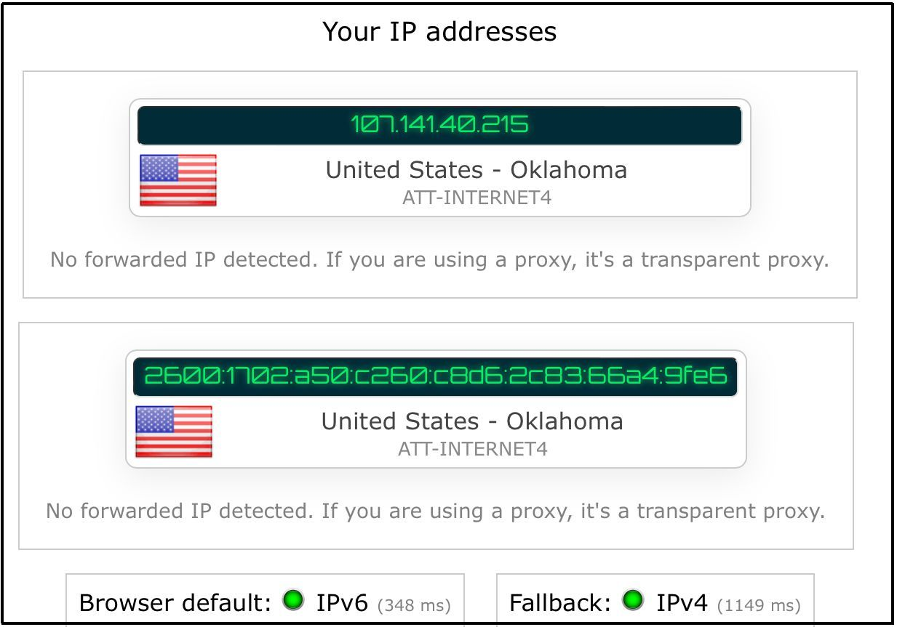
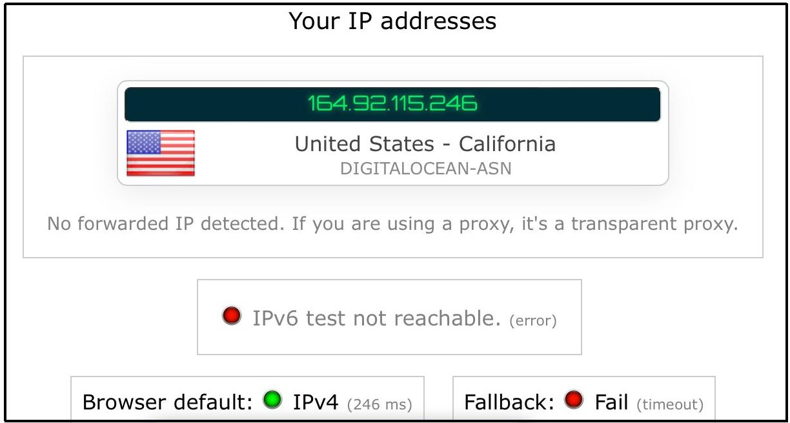
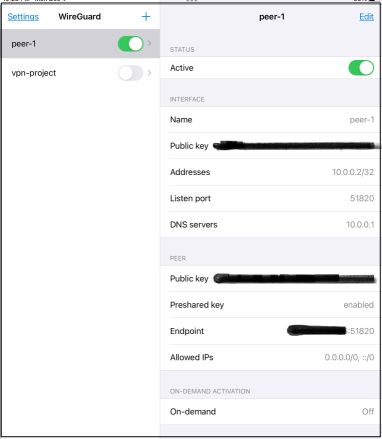
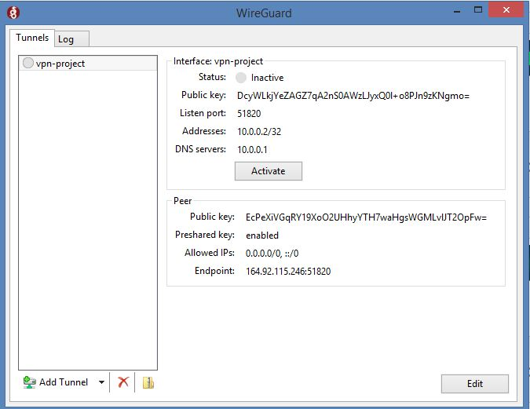
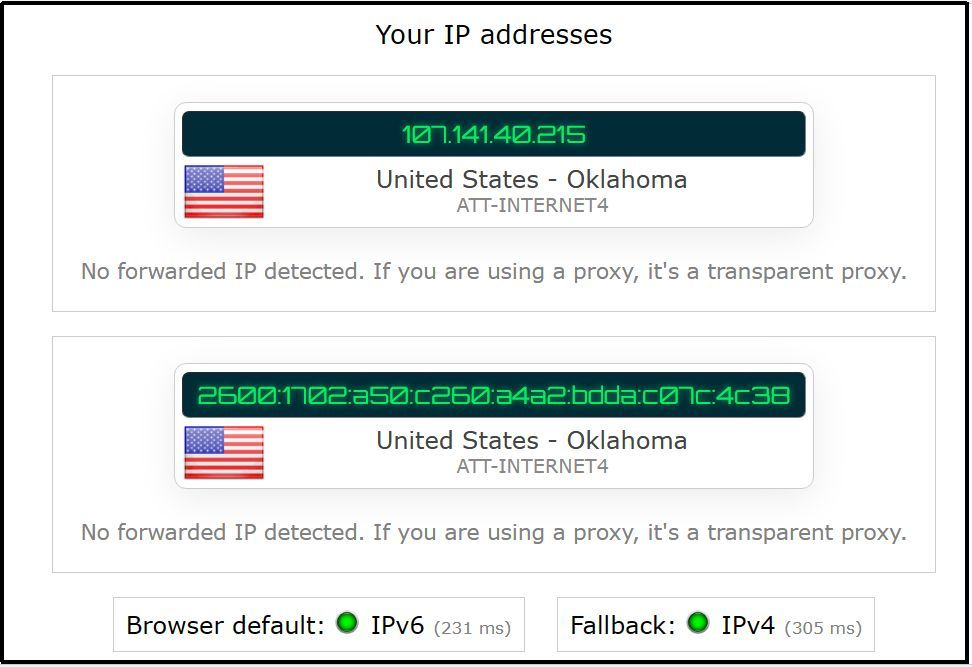
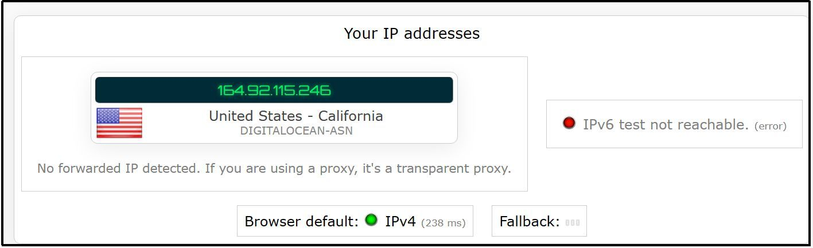

---
title: Wireguard
layout: template
filename: Wireguard.md
--- 
# Wireguard 

***
## Table of Contents:📑
- [Create an Account](#create_account)
- [Create a Droplet](#droplet)
- [Set up a Docker](#docker)
- [Results for both Tablet and Laptop](#results)
## 1. Create a DigitalOcean.com account. <a name="create_account"></a>
***
## 2. Create a Digital Ocean Ubuntu Droplet. <a name="droplet"></a>
***
1) Select a Region
2) Select a Data Center
3) Select an OS Image
4) Select Droplet type.
5) Select CPU Options
6) Select a monthly plan
7) Select an Authentication Method (SSH Key is a safer option.)
   1) To Create a SSH Key Install a .msi file from [PuTTY](https://www.chiark.greenend.org.uk/~sgtatham/putty/download.html)
   2) Open up puttygen
   3) Click Generate
   4) Create a Pass Phrase
   5) Save Private Key
   6) Add SSH Key

## 3. Set Up Docker <a name="docker"></a>
***
1. Necessary Installations
```
sudo apt install apt-transport-https ca-certificates curl software-properties-common -y
```
2. Insert a Docker Key:
```
curl -fsSL https://download.docker.com/linux/ubuntu/gpg | sudo apt-key add -
```
3. Add Docker Repository
```
sudo add-apt-repository \
   "deb [arch=amd64] https://download.docker.com/linux/ubuntu \
   $(lsb_release -cs) \
   stable"
```
4. Go to the Correct Repository
```
apt-cache policy docker-ce
```
5. Install Docker
```
sudo apt install docker-ce -y
```
6. Install Docker-Compose
```
sudo curl -L "https://github.com/docker/compose/releases/download/1.27.4/docker-compose-$(uname -s)-$(uname -m)" -o /usr/local/bin/docker-compose
```
7. Modify the Permissions
```
sudo chmod +x /usr/local/bin/docker-compose
```
8.  Create directories
```
mkdir -p ~/wireguard/
mkdir -p ~/wireguard/config/
```
9. Write into the docker-compose.yml file
```
nano ~/wireguard/docker-compose.yml
```
10. Insert the configurations below
```
version: '3.8'
services:
  wireguard:
    container_name: wireguard
    image: linuxserver/wireguard
    environment:
      - PUID=1000
      - PGID=1000
      - TZ=Asia/Hong_Kong
      - SERVERURL=1.2.3.4
      - SERVERPORT=51820
      - PEERS=pc1,pc2,phone1
      - PEERDNS=auto
      - INTERNAL_SUBNET=10.0.0.0
    ports:
      - 51820:51820/udp
    volumes:
      - type: bind
        source: ./config/
        target: /config/
      - type: bind
        source: /lib/modules
        target: /lib/modules
    restart: always
    cap_add:
      - NET_ADMIN
      - SYS_MODULE
    sysctls:
      - net.ipv4.conf.all.src_valid_mark=1
```
11. Modify some of the configuration.
```
- TZ [timezone]: Modify the timezone. (e.g. America/Chicago)
- SERVERURL [Server IP Address]: It can be located on the DigitalOcean dashboard. (e.g. 164.92.115.246)
- PEERS [Number of User-config-files to Generate or the Names of User-config-files]:  Example --> PEERS=3 will generate peer_1, peer_2 and peer_3. PEERS=pc1,pc2,phone1 will generate peer_pc1, peer_pc2 and peer_phone1.
```
12. Start Wireguard
```
cd ~/wireguard/
docker-compose up -d
```
13. Connect cellular device to wireguard:
```
docker-compose logs -f wireguard
```
14. Utilize the QR code provided to create a tunnel.

## Results: <a name="results"></a>
***
#### Before the VPN is turned on.(Tablet)
***

***
#### After the VPN is turned on. (Tablet)
***


***
#### Check to see if the VPN Tunnel is Active.
***

***
#### Configuration for the Laptop
***

***
#### Before the VPN is turned on.(Laptop)
***

#### After the VPN is turned on. (Laptop)
***

***
